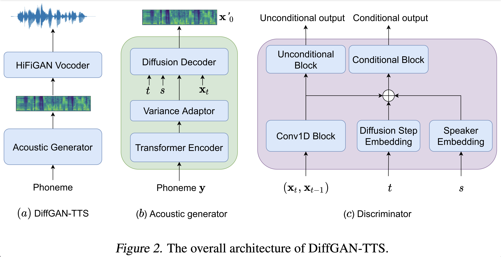
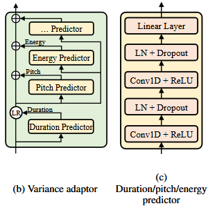
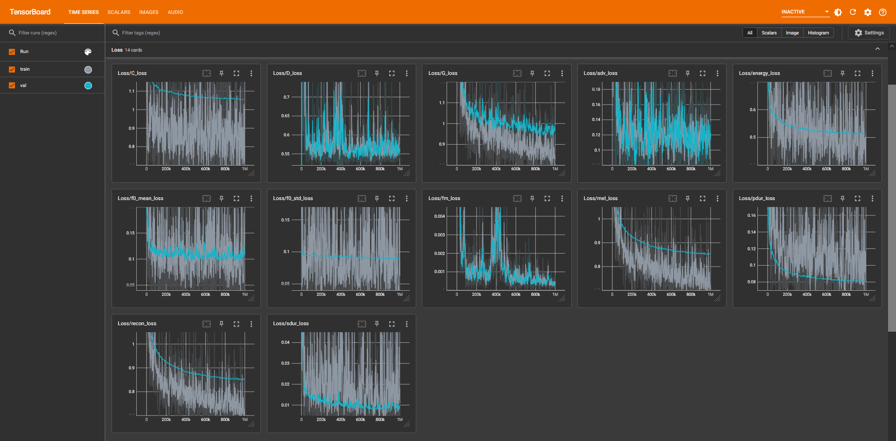

# EmotionDiffGAN-TTS

This model builds upon [DiffGAN-TTS](https://arxiv.org/abs/2201.11972), adding emotional capabilities.

    

  
  

Emotional expression was accomplished by concatenating an emotion vector to both the Variance predictors within the generation model and the convolutional blocks of the discriminator.

## Emotion Vector Model
Emotion vectors are predicted using [Booberjacob/wav2vec2-lg-xlsr-en-speech-circumplex-emotion-recognition](https://huggingface.co/Booberjacob/wav2vec2-lg-xlsr-en-speech-circumplex-emotion-recognition). Run the provided script after preprocessing.py.

	   python3 process_emotions.py --dataset DATASET
  
 ## Datasets
 - [LJSpeech](https://keithito.com/LJ-Speech-Dataset/)
 - [VCTK](https://datashare.ed.ac.uk/handle/10283/3443)
 - [EEmotion](https://huggingface.co/datasets/Booberjacob/EEmotion)
 - [JL corpus](https://www.kaggle.com/datasets/tli725/jl-corpus)
 - [CREMA-D](https://github.com/CheyneyComputerScience/CREMA-D)

## Naive Losses
The following losses are on the 'Combined' dataset.

    

## Inference
Single emotion inference:

	python3 synthesize.py --text "YOUR_DESIRED_TEXT" --model MODEL --speaker_id SPEAKER_ID --restore_step RESTORE_STEP --mode single --dataset DATASET --emotion EMOTION

Multi-emotion inference:

	python3 synthesize.py --text "YOUR_DESIRED_TEXT" --model MODEL --speaker_id SPEAKER_ID --restore_step RESTORE_STEP --mode cycle --dataset DATASET

# References

 - [DiffGAN-TTS](https://github.com/keonlee9420/DiffGAN-TTS)
 - [Fastspeech2](https://arxiv.org/pdf/2006.04558)
